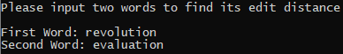
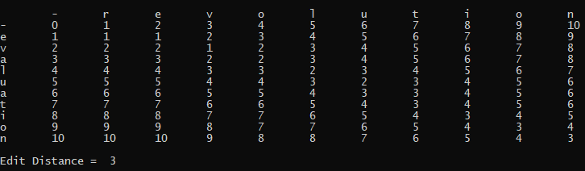
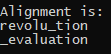

# Edit Distance
Levenshtein (1966) introduced a dynamic programming algorithm called **edit distance** between two strings as the minimum number of elementary operations (insertions, deletions, and substitutions) to transform one string into the other

# Project Description
Write a program to calculate the edit distance between two words and output both the distance and an alignment that demonstrates the result. Your program should:
1. Ask for input of two words\

2. Calculate & output the edit distance\

3. Output the alignment between the two strings that verifies the edit distance\

# How to Run File
1. Double click on the **edit_distance.exe** file
